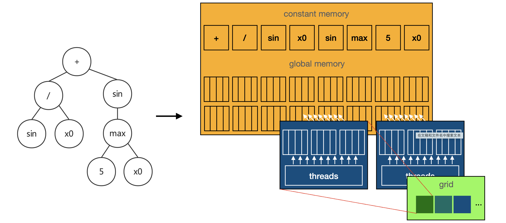

# Speeding Up Genetic Programming Based Symbolic Regression Using GPUs

------



------

## Introduction 

> Symbolic regression can represent relationships from data as a concise and interpretable function. Symbolic regression is achieved as an optimization problem. Given a dataset $(X, y)$, symbolic regression is achieved by optimizing an interpretable function $f(X) : \mathbb{R}^n \to \mathbb{R}$ to minimize the loss $D(f(x), y)$.
>
> This work leverages GPU's computing capability to speed up Genetic Programming (GP) based symbolic regression.


## Arguments

| Name                     | Type                 | Explanation                                                  |
| ------------------------ | -------------------- | ------------------------------------------------------------ |
| population_size          | int                  | --                                                           |
| generations              | int                  | --                                                           |
| tournament_size          | int                  | --                                                           |
| stopping_criteria        | float                | If the minimum metric is less than **stopping_criteria**, than stop iteration. |
| constant_range           | pair\<float, float\> | The range of constant nodes.                                 |
| init_depth               | pair\<int, int\>     | The range of program's initial depth.                        |
| init_method              | InitMemthod          | Population initialization method.                            |
| function_set             | vector\<Function\>   | --                                                           |
| metric                   | Metric               | Metric type.                                                 |
| restrict_depth           | bool                 | Weather to limit the depth of programs.                      |
| max_program_depth        | int                  | Valid when **restrict_depth** is true. If a program's depth is more than **max_program_depth**, it will be performed hoist mutation until it reaches the required depth. |
| parsimony_coefficient    | float                | Since the program is expected to be concise, an extra penalty is added to the length of the program. $loss^{\prime} = loss + parsimony\_coefficient * program.length$. |
| p_crossover              | float                | --                                                           |
| p_subtree_mutation       | float                | --                                                           |
| p_hoist_mutation         | float                | --                                                           |
| p_point_mutation         | float                | --                                                           |
| p_point_replace          | float                | --                                                           |
| p_constant               | float                | The probability that the terminal is a constant.             |
| use_gpu                  | bool                 | Weather to perfrom GPU acceleration.                         |
| best_program             | Program              | Records the program with the least loss in the last population. |
| best_program_in_each_gen | vector\<Program\>    | Records programs with the least loss in each population.     |
| regress_time_in_sec      | float                | Records the regression time.                                 |


## Run Symbolic Regression

> Environment: CUDA Version >= 9.0


#### 1. Prepare Dataset

> Suppose we want to do a 2-dim regression for $f(a, b)$, which has following properties: $f(1, 2) = 3, f(2, 3) = 5, f(1, 1) = 2$. Then, we should prepare dataset and real-value set in the following format.

```c++
#include "include/cusr.h"
using namesapce std;

typedef vector<vector<float>> dataset_t; 
typedef vector<float> real_t;

/* **************************************************************************************
 * Suppose we want to do a 2-dim regression for f(a, b), which has following properties:
 * f(1, 2) = 3, f(2, 3) = 5, f(1, 1) = 2.
 * Then, we should prepare dataset and real-value set in the following format.
 * ************************************************************************************** */

dataset_t dataset = {{1, 2}, {2, 3}, {1, 1}, {....}};
real_t real_value = {3, 5, 2, ..};
```


#### 2. Specify GPU Device

> The CUSR does not support running on multiple GPUs currently.

```c++
/* **************************************************************************************
 * If there are multiple GPUs on your device, specify the needed one.
 * Skip this step if your device has single GPU.
 * ************************************************************************************** */

void choose_gpu() {
	int count;
  cudaGetDeviceCount(&count);
  
  if(count == 0) {
    cerr << "There is no required GPU device." << endl;
    return;
  }
  
  cout << "Input GPU id" << endl;
  
  int gpu_id;
  cin >> gpu_id;
  cudaSetDevice(gpu_id);
}
```


#### 3. Set Arguments, Do Regression, and Print Results

```c++
int main() {
	
  // Specify GPU, skip if there is only one GPU.
	choose_gpu();

  // Create a regression engine.
  cusr::RegressionEngine reg;

  // Set arguments.
  reg.function_set = { _add, _cos, _sub, _div, _tan, _mul, _sin };
  reg.use_gpu = true;            
  reg.max_program_depth = 10;                      
  reg.population_size = 50;
  reg.generations = 50;
  reg.parsimony_coefficient = 0;        
  reg.const_range = {-5, 5};     
  reg.init_depth = {4, 10};      
  reg.init_method = init_t::half_and_half;  
  reg.tournament_size = 3;                  
  reg.metric = metric_t::root_mean_square_error; 

  // Train
  reg.fit(dataset, real_value); 
	
  // After regression
  // Print results ...
  cout << "Execution Time: " << reg.regress_time_in_sec << endl;
  cout << "Best Fitness  : " << reg.best_program.fitness << endl;
  cout << "Best Program (in prefix):  " << cusr::program::prefix_to_string(reg.best_program.prefix) << endl;
  cout << "Best Program (in infix) :  " << cusr::program::prefix_to_infix(reg.best_program.prefix) << endl;
  
  return 0;
}
```


#### 4. Compile and Run

```shell
nvcc -o sr main.cu src/*.cu
./sr
```
